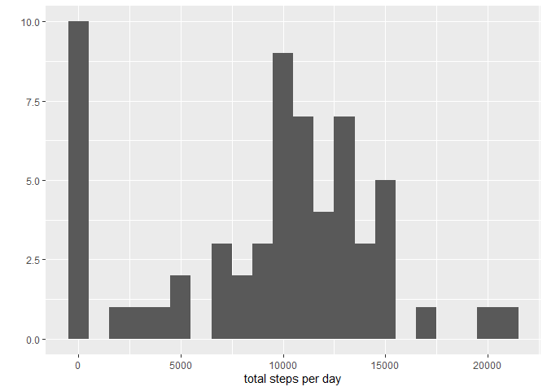
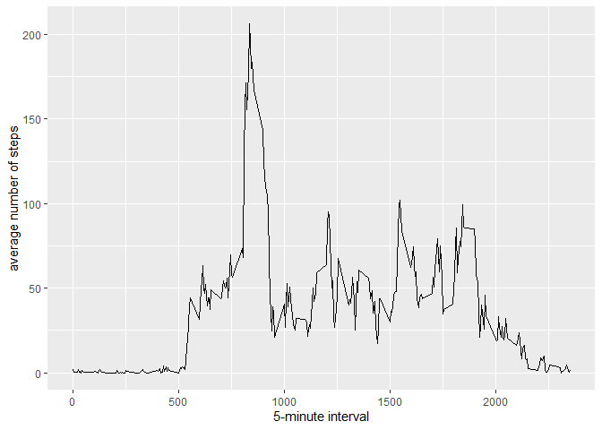
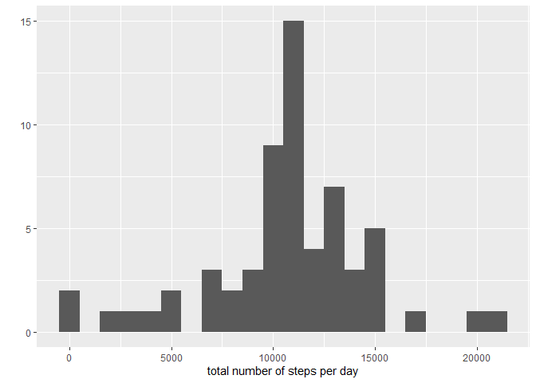
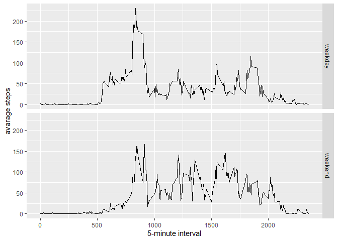

## Loading and preprocessing the data

Code for reading the dataset and processing the data

```r
data <- read.csv("activity.csv")
summary(data)
```

```
##      steps            date              interval     
##  Min.   :  0.00   Length:17568       Min.   :   0.0  
##  1st Qu.:  0.00   Class :character   1st Qu.: 588.8  
##  Median :  0.00   Mode  :character   Median :1177.5  
##  Mean   : 37.38                      Mean   :1177.5  
##  3rd Qu.: 12.00                      3rd Qu.:1766.2  
##  Max.   :806.00                      Max.   :2355.0  
##  NA's   :2304
```
## Question 1 - What is mean total number of steps taken per day?

```r
total.steps <- tapply(data$steps, data$date, FUN=sum, na.rm=TRUE)
```

#### Make a histogram of the total number of steps taken each day

```r
library(ggplot2)
qplot(total.steps, binwidth=1000, xlab="total steps per day")
```

```
## Warning: `qplot()` was deprecated in ggplot2 3.4.0.
## This warning is displayed once every 8 hours.
## Call `lifecycle::last_lifecycle_warnings()` to see where this warning was
## generated.
```

<!-- -->

#### Calculate and report the mean and median of the total number of steps taken per day

```r
mean(total.steps, na.rm=TRUE)
```

```
## [1] 9354.23
```

```r
median(total.steps, na.rm=TRUE)
```

```
## [1] 10395
```

## Question 2 - What is the average daily activity pattern?
#### Make a time series plot of the 5-minute interval (x-axis) and the average number of steps taken, averaged across all days (y-axis)

```r
average <- aggregate(x=list(steps=data$steps), by=list(interval=data$interval),
                      FUN=mean, na.rm=TRUE)
ggplot(data=average, aes(x=interval, y=steps)) +
  geom_line() +
  xlab("5-minute interval") +
  ylab("average number of steps")
```

<!-- -->

## Question 3 - Imputing missing values
#### Calculate and report the total number of missing values in the dataset

```r
missingValues <- is.na(data$steps)
table(missingValues)
```

```
## missingValues
## FALSE  TRUE 
## 15264  2304
```

#### Devise a strategy for filling in all of the missing values in the dataset
In this case we replace each missing value with the mean value of its 5-minute interval

```r
fill.value <- function(steps, interval) {
  filled <- NA
  if (!is.na(steps))
    filled <- c(steps)
  else
    filled <- (average[average$interval==interval, "steps"])
  return(filled)
}
```

#### Create a new dataset that is equal to the original dataset but with the missing data filled in

```r
filled.data <- data
filled.data$steps <- mapply(fill.value, filled.data$steps, filled.data$interval)
```

#### Make a histogram of the total number of steps per day and calculate the mean and median total number of steps taken per day

```r
stepsTotal <- tapply(filled.data$steps, filled.data$date, FUN=sum)
qplot(stepsTotal, binwidth=1000, xlab="total number of steps per day")
```

<!-- -->

```r
mean(stepsTotal)
```

```
## [1] 10766.19
```

```r
median(stepsTotal)
```

```
## [1] 10766.19
```

## Question 4 - Are there differences in activity patterns between weekdays and weekends?
#### Create a new factor variable in the dataset with two levels – “weekday” and “weekend”

```r
filled.data$dateType <-  ifelse(as.POSIXlt(filled.data$date)$wday %in% c(0,6), 'weekend', 'weekday')
```

#### Make a panel plot containing a time series plot of the 5-minute interval (x-axis) and the average number of steps taken

```r
filled.dataAverage <- aggregate(steps ~ interval + dateType, data=filled.data, mean)
ggplot(filled.dataAverage, aes(interval, steps)) + 
  geom_line() + 
  facet_grid(dateType ~ .) +
  xlab("5-minute interval") + 
  ylab("avarage steps")
```

<!-- -->
